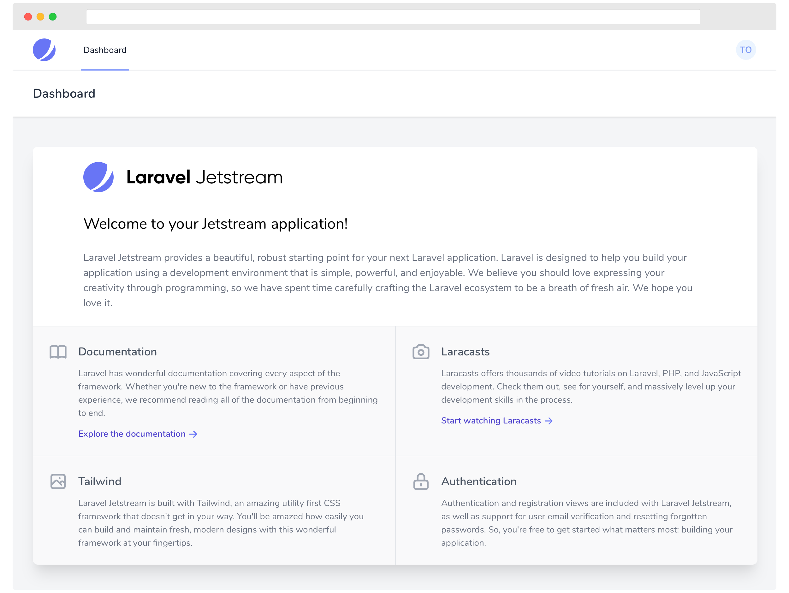

2011 yılında ilk versiyonuyla web development âlemine "merhaba" diyen Laravel’in bu hafta (08.09.2020) itibariyle 8. versiyonu resmi olarak kullanıma sunuldu.

Yeniliklere baktığımızda breaking change olmamakla birlikte <a href="https://github.com/laravel/jetstream" target="_blank">Laravel Jetstream</a>, model factory sınıfları, migration squashing, job batching, daha gelişmiş rate limiting, queue iyileştirmeleri ve dinamik Blade component'leri gibi özelliklerin tanıtıldığını ve Laravel 7'deki geliştirmelere/iyileştirmelere devam edildiğini görebiliriz. Developer deneyimini daha da ileri taşıyacak olan yeni özellikleri aşağıda ele aldım:

-   [Laravel JetStream](#laravel-jetstream)
-   [Models Klasörü](#models-klasörü)
-   [Model Factory Sınıfları](#model-factory-sınıfları)
-   [Migration Squashing](#migration-squashing)
-   [Job Batching](#job-batching)
-   [Rate Limiting Geliştirmeleri](#rate-limiting-geliştirmeleri)
-   [Bakım Modu Geliştirmeleri](#bakım-modu-geliştirmeleri)
-   [Closure Dispatch / Chain `catch`](#closure-dispatch--chain-catch)
-   [Dinamik Blade Component'leri](#dinamik-blade-componentleri)
-   [Event Listener Geliştirmeleri](#event-listener-geliştirmeleri)
-   [Zaman Testi İçin Helper Fonksiyonları](#zaman-testi-i̇çin-helper-fonksiyonları)
-   [Artisan serve Geliştirmeleri](#artisan-serve-geliştirmeleri)
-   [Tailwind İle Pagination Linkleri](#tailwind-i̇le-pagination-linkleri)
-   [Routing Namespace Güncellemeleri](#routing-namespace-güncellemeleri)

## Laravel Jetstream

Hemen hemen her uygulamanın ihtiyaç duyabileceği kullanıcı girişi/kaydı, e-posta doğrulama, two-factor authentication (2FA), session yönetimi, API authentication gibi özellikleri içinde barındıran Laravel ekosisteminin yeni ürünü Laravel Jetstream, bir Laravel uygulaması için başlangıç şablonu (iskelesi) diyebiliriz.

Daha önce, <a href="https://github.com/laravel/ui" target="_blank">`laravel/ui`</a> paketi uygulamamızda authentication işlemlerini otomatik olarak yapmamıza imkân sağlıyordu. Laravel Jetstream ise bu paketin daha gelişmiş hali olarak düşünebiliriz. Arayüzü <a href="https://tailwindcss.com" target="_blank">Tailwind CSS</a> ile geliştirilen Laravel JetStream, isteğe bağlı olarak <a href="https://github.com/livewire/livewire" target="_blank">Livewire</a> veya <a href="https://github.com/inertiajs/inertia-laravel" target="_blank">Inertia</a> ile birlikte kullanılabilir.

Laravel Jetstream web authentication işlemleri için <a href="https://github.com/laravel/fortify" target="_blank">Laravel Fortify</a>, token bazlı authentication (SPA, mobil uygulamalar) için ise <a href="https://github.com/laravel/sanctum" target="_blank">Laravel Sanctum</a> kullanmakta.

Kurulum ve kullanımına ayrı bir yazıya konu olacak nitelikte olduğundan burada yer vermedim. Detaylı bilgiler için <a href="https://jetstream.laravel.com" target="_blank">dokümantasyonuna</a> bakabilirsiniz.



## Models Klasörü

Laravel'in önceki versiyonlarında Eloquent model dosyalarının varsayılan yeri `app` klasörüydü. Modellerin controller veya middleware dosyalarına benzer özel bir klasörü yoktu. Bunun nedenini Laravel, <U>Models</U> kelimesinin farklı geliştirciler için farklı anlamlara gelebileceğinden kafalarda karışıklık yaratması şeklinde <a href="https://laravel.com/docs/7.x/structure#introduction" target="_blank">açıklıyor</a>. Örneğin, model bazı geliştiriciler için uygulamanın tüm business logic’i anlamına gelirken bazı geliştiriciler içinse (ben dahil) ilişkisel veritabanı ile ilgili işlemleri yapmamızı sağlayan sınıf/obje anlamına gelmektedir.

Model dosyalarının derli toplu olması için manuel olarak `app/Models` klasörü oluşturuyorduk. Topluluğun yoğun talebi üzerine artık Eloquent model dosyalarımızın varsayılan yeri `app/Models` olacak. Tüm Artisan komutları da buna duyarlı olacak. Yani eğer projede `app/Models` klasörü varsa, framework onu model klasörü olarak varsayacak. Yoksa da, eskisi gibi `app` klasörünü kullanmaya devam edecek. 🎉

## Model Factory Sınıfları

Eskiden model factory'leri sınıf tabanlı değildi ve `factory` global fonksiyonu ile test verileri oluşturabiliyorduk. Laravel 8'de bu fonksiyon kaldırıldı ve factory'ler sınıf tabanlı olacak şekilde tamamiyle yeniden yazıldı. Artık her modelde `HasFactory` traiti olacak ve modellerin kendine ait factory sınıfları olacak.

Örneğin, yeni Laravel projesi oluşturduğumuzda `database/factories` klasörü içinde `UserFactory.php` dosyası bulunuyor. Bu dosyanın içeriği eskiden şu şekildeydi:

```php:title=app/database/factories/UserFactory.php
<?php

/** @var \Illuminate\Database\Eloquent\Factory $factory */

use App\Models\User;
use Faker\Generator as Faker;
use Illuminate\Support\Str;

$factory->define(User::class, function (Faker $faker) {
    return [
        'name' => $faker->name,
        'email' => $faker->unique()->safeEmail,
        'email_verified_at' => now(),
        'password' => '$2y$10$92IXUNpkjO0rOQ5byMi.Ye4oKoEa3Ro9llC/.og/at2.uheWG/igi', // password
        'remember_token' => Str::random(10),
    ];
});
```

Ve şu şekilde kullanırdık:

```php
factory(App\Models\User::class, 10)->make(); // Test amaçlı 10 tane kullanıcı oluştur.
```

Bundan sonra factory'ler sınıf tabanlı olacak:

```php:title=app/database/factories/UserFactory.php
<?php

namespace Database\Factories;

use App\Models\User;
use Illuminate\Database\Eloquent\Factories\Factory;
use Illuminate\Support\Str;

class UserFactory extends Factory
{
    /**
     * The name of the factory's corresponding model.
     *
     * @var string
     */
    protected $model = User::class;

    /**
     * Define the model's default state.
     *
     * @return array
     */
    public function definition()
    {
        return [
            'name' => $this->faker->name,
            'email' => $this->faker->unique()->safeEmail,
            'email_verified_at' => now(),
            'password' => '$2y$10$92IXUNpkjO0rOQ5byMi.Ye4oKoEa3Ro9llC/.og/at2.uheWG/igi', // password
            'remember_token' => Str::random(10),
        ];
    }
}
```

Ve şu şekilde kullanabileceğiz:

```php
$users = App\Models\User::factory()->count(10)->make(); // Test amaçlı 10 tane kullanıcı oluştur.
```

Factory'ler sınıf tabanlı olacağından dolayı içine ihtiyaç duyduğumuz metodları yazabiliriz. Yukarıdaki örnek üzerinden gidecek olursak, kullanıcıların `status` değerlerini tuttuğumuzu ve `status` değerinin `active` olduğu 10 tane kullanıcı oluşturmak istediğimizi varsayalım. Bunu yapmak için kendi metodumuzu yazmalıyız ve base `Factory` sınıfının `state` metodunu kullanmalıyız:

```php
/**
 * Kullanıcının aktif olduğunu belirtir.
 *
 * @return \Illuminate\Database\Eloquent\Factories\Factory
 */
public function active()
{
    return $this->state([
        'status' => 'active',
    ]);
}
```

Daha sonra şu şekilde kullanabiliriz:

```php
$users = App\Models\User::factory()->count(10)->active()->make(); // Test amaçlı 10 tane aktif kullanıcı oluştur.
```

Model factory sınıfları ilişkisel verileri de desteklemektedir. Yine yukarıdaki örnek üzerinden gidelim. `User` modelinin `Post` modeliyle `hasMany` ilişkisi ve `Post` modelinin `User` modeliyle `belongsTo` ilişkisi olduğunu varsayalım.

`hasMany` ilişkisi üzerinden model oluşturmak istiyorsak `has` metodunu kullanabiliriz:

```php
$users = App\Models\User\User::factory()->has(App\Models\Post::factory()->count(10))->create(); // Test amaçlı bir kullanıcı ve bu kullanıcıya ait 10 tane `Post` oluştur.

// veya ilişki adını özelleştirerek kullanabiliriz (`posts` değilse):

$users = App\Models\User\User::factory()->has(App\Models\Post::factory()->count(10), 'posts')->create(); // Test amaçlı bir kullanıcı ve bu kullanıcıya ait 10 tane `Post` oluştur.

// veya factory'nin magic metodunu kullanabiliriz:

$users = User::factory()->hasPosts(10)->create(); // Test amaçlı bir kullanıcı ve bu kullanıcıya ait 10 tane `Post` oluştur.
```

`belongsTo` ilişkisi üzerinden model oluşturmak istiyorsak da `for` metodunu kullanabiliriz:

```php
$posts = App\Models\Post::factory()->count(10)->for(App\Models\User::factory())->create(); // Test amaçlı bir kullanıcı için 10 tane `Post` oluştur.

// veya ilişki adını özelleştirerek kullanabiliriz (`user` değilse):

$posts = App\Models\Post::factory()->count(10)->for(App\Models\User::factory(), 'user')->create(); // Test amaçlı bir kullanıcı için 10 tane `Post` oluştur.

// veya factory'nin magic metodunu kullanabiliriz:

$posts = App\Models\Post::factory()->count(10)->forUser()->create(); // Test amaçlı bir kullanıcı için 10 tane `Post` oluştur.
```

Burada dikkatli olmamız gereken bir nokta var; `make` metodu oluşturulan verileri veritabanına kaydetmezken, `create` metodu Eloquent'in `save` metodunu kullanarak modelleri veritabanına kaydeder.

Son olarak, eğer factory'leri eski yöntemle kullanmaya devam etmek veya upgrade sürecini kolaylaştırmak/hızlandırmak istiyorsanız [`laravel/legacy-factories`](https://github.com/laravel/legacy-factories) paketini kullanabilirsiniz.

<Collapsable title="Kaynak" titleSize="1rem">
    <a href="https://laravel.com/docs/8.x/database-testing" target="_blank">
        Database Testing
    </a>
</Collapsable>

## Migration Squashing

Uzun zamandır geliştirdiğimiz projelerde migration dosyaları gitgide artmaktadır. Veritabanında yaptığımız her değişiklik için bir migration dosyası oluşturuyoruz. Bu da zamanla `database/migrations` klasörünün şişmesine neden olacaktır. Örneğin, çalıştığım <a href="https://bulutfiloyonetimi.com/" target="_blank">projede</a> 600'den fazla migration dosyası var.

Eğer MySQL veya PostgreSQL kullanıyorsak, Laravel 8 itibariyle veritabanı şemamızı tek bir SQL dosyasında tutarak eski migration dosyalarını silebiliriz. Bu işlemi yapmak şu komutu çalıştırmalıyız:

```bash
php artisan schema:dump
```

Eğer migration dosyalarının da beraberin otomatik olarak silinmesini istiyorsak şunu çalıştırmamız yeterli olacaktır:

```bash
php artisan schema:dump --prune
```

Bu komutu çalıştırdıktan sonra `database/schema` klasöründe veritabanı şema dosyasının oluştuğunu görebiliriz. Projede yeni migration oluşturarak `migrate` yaptığımızda önce bu SQL dosyası sonra da yeni oluşturduğumuz migration dosyaları çalıştırılır. Bu yöntemi ara sıra uygulamakta yarar var. 😅

<Info>
    Bu özellik sadece MySQL ve PostgreSQL veritabanlarında desteklenmektedir.
</Info>
<Collapsable title="Kaynak" titleSize="1rem">
    <a
        href="https://laravel.com/docs/8.x/migrations#squashing-migrations"
        target="_blank"
    >
        Squashing Migrations
    </a>
</Collapsable>

## Job Batching

Job batching özelliği `Bus` facade'ı yardımıyla toplu şekilde job çalıştırmamıza ve bu süreci kolayca yönetmemize imkân sağlıyor. Örneğin, birkaç job işlemimiz var ve bu görevleri aynı anda çalıştırmak istiyoruz. Hemen aklımıza şu sorular takılabilir; _hata çıktığı anda bunu nasıl tespit edebiliriz?_ veya _tüm işlemlerin tamamlandığını nasıl anlarız?_ İşte tam bu noktada `then`, `catch` ve `finally` callback'leri imdadımıza koşuyor.

Bu özelliği kullanmadan önce veritabanında job bilgilerinin tutulacağı tabloyu oluşturmamız gerekiyor. Bunun aşağıdaki komutları çalıştırmalıyız:

```bash
php artisan queue:batches-table
php artisan migrate
```

Daha sonra oluşturacağımız job'lara `Illuminate\Bus\Batchable` traitini eklememiz gerekiyor:

```php
<?php

namespace App\Jobs;

use Illuminate\Bus\Queueable;
use Illuminate\Contracts\Queue\ShouldQueue;
use Illuminate\Foundation\Bus\Dispatchable;
use Illuminate\Queue\InteractsWithQueue;
use Illuminate\Queue\SerializesModels;

class ProcessPodcast implements ShouldQueue
{
    use Batchable, Dispatchable, InteractsWithQueue, Queueable, SerializesModels;

    /**
     * Create a new job instance.
     *
     * @return void
     */
    public function __construct()
    {
        //
    }

    /**
     * Execute the job.
     *
     * @return void
     */
    public function handle()
    {
        //
    }
}
```

Daha sonra şu şekilde topluca çalıştırabiliriz (dispatch):

```php
use App\Jobs\ProcessPodcast;
use App\Podcast;
use Illuminate\Bus\Batch;
use Illuminate\Support\Facades\Batch;
use Throwable;

$batch = Bus::batch([
    new ProcessPodcast(Podcast::find(1)),
    new ProcessPodcast(Podcast::find(2)),
    new ProcessPodcast(Podcast::find(3)),
    new ProcessPodcast(Podcast::find(4)),
    new ProcessPodcast(Podcast::find(5)),
])->then(function (Batch $batch) {
    // Tüm job işlemleri başarılı bir şekilde tamamlandı...
})->catch(function (Batch $batch, Throwable $e) {
    // İlk hata tespit edildi...
})->finally(function (Batch $batch) {
    // Tüm job işlemi tamamlandı...
})->dispatch();

return $batch->id;
```

Laravel Horizon veya Laravel Telescope kullanıyorsanız, daha kullanışlı debug bilgilerini alabilmek için çalıştıracağımız batch'lere `name` metodunu kullanarak isim verebiliriz:

```php
$batch = Bus::batch([
    // ...
])->then(function (Batch $batch) {
    // Tüm job işlemleri başarılı bir şekilde tamamlandı...
})->catch(function (Batch $batch, Throwable $e) {
    // İlk hata tespit edildi...
})->finally(function (Batch $batch) {
    // Tüm job işlemi tamamlandı...
})->name('Process Podcasts')->dispatch(); // highlight-line
```

Aynı şekilde, bağlantı bilgisini `onConnection` ve queue bilgisini de `onQueue` metodunu kullanarak tanımlayabiliriz:

```php
$batch = Bus::batch([
    // ...
])->then(function (Batch $batch) {
    // Tüm job işlemleri başarılı bir şekilde tamamlandı...
})->catch(function (Batch $batch, Throwable $e) {
    // İlk hata tespit edildi...
})->finally(function (Batch $batch) {
    // Tüm job işlemi tamamlandı...
})->onConnection('redis')->onQueue('podcasts')->dispatch(); // highlight-line
```

Burada dikkat etmemiz gerek bir nokta var. `then` tüm görevler **_başarılı_** olarak tamamlandığında, `finally` ise sonuç başarılı veya başarısız farketmeksizin tüm görevler tamamlandığında çalışır.

Batch ile ilgili bazı kullanışlı property ve metodlar:

```php
// Batch'in UUID bilgisi...
$batch->id;

// Batch'in ismi (isimlendirdiyseniz)...
$batch->name;

// Batch'e atanmış job'ların sayısı...
$batch->totalJobs;

// Queue tarafından daha çalıştırılmamış bekleyen job'ların sayısı...
$batch->pendingJobs;

// Başarısız sonuçlanan job'ların sayısı...
$batch->failedJobs;

// Tamamlanmış olan job'ların sayısı...
$batch->processedJobs();

// Batch'in tamamlanan yüzdesi (0-100)...
$batch->progress();

// Batch'in tamamlanıp tamamlanmadığını belirtir...
$batch->finished();

// Bacth'i iptal eder...
$batch->cancel();

// Batch'in iptal edilip edilmediğini belirtir...
$batch->cancelled();
```

Batch bilgilerinin anlık olarak JSON çıktısını görüntülemek de mümkün. Bunu yapmak için örnek bir route oluşturarak `Bus` facade'inin `findBatch` metodundan yararlanabiliriz:

```php:title=app/routes/web.php
use Illuminate\Support\Facades\Bus;
use Illuminate\Support\Facades\Route;

Route::get('/batch/{batchId}', fn (string $batchId) => Bus::findBatch($batchId)); // highlight-line
```

Batch içindeki herhangi bir job başarısız olduğunda Laravel o job'un _iptal edildiğini_ varsayar. Dilerseniz bu davranışı `allowFailures` metodunu kullanarak değiştirebilirsiniz:

```php
$batch = Bus::batch([
    // ...
])->then(function (Batch $batch) {
    // Tüm job işlemleri başarılı bir şekilde tamamlandı...
})->catch(function (Batch $batch, Throwable $e) {
    // İlk hata tespit edildi...
})->finally(function (Batch $batch) {
    // Tüm job işlemi tamamlandı...
})->allowFailures()->dispatch(); // highlight-line
```

Bunu yaptıktan sonra job başarısız olduğunda otomatik olarak _iptal_ damgası yemeyecektir.

Başarısız olan bacth job'larını tekrar çalıştırmak isterseniz `queue:retry-batch` komutundan yararlanabilirsiniz:

```bash
php artisan queue:retry-batch 32dbc76c-4f82-4749-b610-a639fe0099b5 # Batch'in UUID bilgisi
```

<Collapsable title="Kaynak" titleSize="1rem">
    <a href="https://laravel.com/docs/8.x/queues#job-batching" target="_blank">
        Job Batching
    </a>
</Collapsable>

## Rate Limiting Geliştirmeleri

Bildiğiniz gibi daha önceleri rate limiting için `throttle` middleware API'sini kullanıyorduk. Laravel 8'de daha da geliştirilen ve esnek hale getirilen rate limiting özelliği için `RateLimiter` facade'ı tanıtıldı. Bu facade yardımıyla artık özel isimlerle rate limiter oluşturabileceğiz. Ama önceki sürümlerle uyumluluğu bozmamak için `throttle` middleware API'si de hâlâ kullanılabilmekte.

`RouteServiceProvider` içindeki `configureRateLimiting` metodunda `RateLimiter` facade'ının `for` metodunu kullanarak özel rate limiter tanımlayabiliriz:

```php:title=app\Providers\RouteServiceProvider.php
<?php

namespace App\Providers;

use Illuminate\Cache\RateLimiting\Limit;
use Illuminate\Foundation\Support\Providers\RouteServiceProvider as ServiceProvider;
use Illuminate\Http\Request;
use Illuminate\Support\Facades\RateLimiter;
use Illuminate\Support\Facades\Route;

class RouteServiceProvider extends ServiceProvider
{
    // ...

    /**
     * Configure the rate limiters for the application.
     *
     * @return void
     */
    protected function configureRateLimiting()
    {
        RateLimiter::for('api', function (Request $request) {
            return Limit::perMinute(60);
        });

        // highlight-start
        RateLimiter::for('global', function (Request $request) {
            return Limit::perMinute(1000); // Dakika başı 1000 isteğe kadar izin ver.
        });
        // highlight-end
    }
}
```

Dilerseniz rate limiter'ı dinamik olarak tanımlayabilirsiniz:

```php:title=app\Providers\RouteServiceProvider.php
RateLimiter::for('uploads', function (Request $request) {
    return $request->user()->vipCustomer()
                ? Limit::none()
                : Limit::perMinute(100); // Kullanıcı VIP değilse dakika başı 100 isteğe kadar izin ver.
});
```

Bazen bazı değerleri baz alarak rate limiting yapmak isteyebiliriz. Örneğin, her IP adresi başına dakikada 60 isteğe kadar izin vermek istiyoruz. Bunu `by` metoduyla yapabiliriz:

```php:title=app\Providers\RouteServiceProvider.php
RateLimiter::for('uploads', function (Request $request) {
    return Limit::perMinute(60)->by($request->ip());  // IP adresi başına dakikada 60 isteğe kadar izin ver.
});
```

Hatta bir rate limiter içinde dizi halinde birkaç rate limit döndürmek mümkün:

```php
RateLimiter::for('login', function (Request $request) {
    return [
        Limit::perMinute(500), // Dakika başı 500 isteğe kadar izin ver.
        Limit::perMinute(3)->by($request->input('email')), // E-posta başı dakikada 3 isteğe kadar izin ver.
    ];
});
```

Oluşturduğumuz rate limiter'ları `throttle` middleware yardımıyla route'lara veya route gruplarına atayabiliriz:

```php:title=app\routes\web.php
Route::middleware(['throttle:uploads'])->group(function () {
    Route::post('/audio', function () {
        //
    });

    Route::post('/video', function () {
        //
    });
});
```

<Collapsable title="Kaynak" titleSize="1rem">
    <a
        href="https://laravel.com/docs/8.x/routing#rate-limiting"
        target="_blank"
    >
        Rate Limiting
    </a>
</Collapsable>

## Bakım Modu Geliştirmeleri

`php artisan down` komutuyla aktifleştirdiğimiz bakım modunda `allow` seçeneğiyle belirlediğimiz IP adreslerini hariç bırakabiliyorduk. Örneğin:

```bash
php artisan down --allow=127.0.0.1
```

Bundan sonra belirlediğimiz token ile `secret` seçeneğini kullanarak da bakım modundaki uygulamamıza erişim sağlayabiliriz:

```bash
php artisan down --secret="1630542a-246b-4b66-afa1-dd72a4c43515"
```

Daha sonra uygulamamızda `https://example.com/1630542a-246b-4b66-afa1-dd72a4c43515` adresini ziyaret etmemiz gerekmekte. Ziyaret sırasında Laravel, bakım modundayken uygulamamıza erişebilmemiz için tarayıcımızda cookie oluşturur. Cookie oluşturulduktan sonra anasayfaya yönlendirileceğiz ve artık normal moddaymış gibi uygulamamızı kullanabiliriz.

Uygulamamız bakım modundayken Laravel, varsayılan olarak 503 status koduyla bakım sayfasını render eder. Bakım sayfasını özelleştirmek için `resources/views/errors/503.blade.php` dosyasını oluştururak istediğimiz tasarımı yapabiliriz. Buna alternatif olarak `redirect` seçeneğiyle farklı sayfaya yönlendirmemize de imkân sağlıyor Laravel:

```bash
php artisan down --redirect=/
```

Son olarak, bakım modunun _pre-render_ özelliğine ve onun önemine değinmek istiyorum. Deployment sırasında uygulamamızı bakım moduna aldığımızı düşünelim. Composer paketlerinin veya framework bileşenlerinin tam kurulum/güncelleme esnasında uygulamayı ziyaret eden kullanıcıların hatayla karşılaşma ihtimali vardır. Çünkü uygulamanın bakım modunda olup olmadığını tespit etmek için framework'ün önemli bir bölümünün yüklenmesi (boot olması) gerekmekte. Bu da gerekli paketlerin ve bileşenlerin tam kurulumundan sonra mümkün olacaktır.

Bunu çözmek için, Laravel bize bakım sayfasını pre-render yapma imkânı veriyor. Yani bu özellik, request sürecinin en tepesinde paketler ve framework bileşenleri yüklenmeden önce uygulamanın bakım modunda olup olmadığını tespit ederek bakım sayfasını render etmemizi sağlıyor. `render` seçeneğiyle bakım sayfasını belirtebiliriz:

```bash
php artisan down --render="errors::503"
```

<Collapsable title="Kaynak" titleSize="1rem">
    <a
        href="https://laravel.com/docs/8.x/configuration#maintenance-mode"
        target="_blank"
    >
        Maintenance Mode
    </a>
</Collapsable>

## Closure Dispatch / Chain `catch`

Closure tabanlı job'larımız çalışırken (tüm denemelere rağmen) başarısız olarak sonuçlandığında hataları yakalamak için `catch` metodundan yararlanabiliriz:

```php
use Throwable;

dispatch(function () use ($podcast) {
    $podcast->publish();
})->catch(function (Throwable $e) {
    // Job başarısız sonuçlandı...
});
```

<Collapsable title="Kaynak" titleSize="1rem">
    <a
        href="https://laravel.com/docs/8.x/queues#queueing-closures"
        target="_blank"
    >
        Queueing Closures
    </a>
</Collapsable>

## Dinamik Blade Component'leri

Bazı durumlarda dinamik olarak Blade component'i render etmemiz gerekebilir. Bunu Laravel 8'den itibaren built-in olarak gelen `dynamic-component` component'i yardımıyla yapabiliriz:

```php
<x-dynamic-component :component="$componentName" class="mt-4" />
```

<Collapsable title="Kaynak" titleSize="1rem">
    <a
        href="https://laravel.com/docs/8.x/blade#dynamic-components"
        target="_blank"
    >
        Dynamic Components
    </a>
</Collapsable>

## Event Listener Geliştirmeleri

Event listener'lar artık Closure olarak tanımlanabilmekte. Laravel hangi event'in listen edileceğini tanımladığımız Closure sayesinde anlayacaktır:

```php
use App\Events\PodcastProcessed;
use Illuminate\Support\Facades\Event;

Event::listen(function (PodcastProcessed $event) {
    //
});
```

Ek olarak, bu Closure `Illuminate\Events\queueable` fonksiyonuyla queue olarak da tanımlanabilir:

```php
use App\Events\PodcastProcessed;
use function Illuminate\Events\queueable;
use Illuminate\Support\Facades\Event;

Event::listen(queueable(function (PodcastProcessed $event) {
    //
}));
```

Queue job'larında olduğu gibi `onConnection`, `onQueue` ve `delay` metodları da queue listener ile beraber kullanılabilir:

```php
use App\Events\PodcastProcessed;
use function Illuminate\Events\queueable;
use Illuminate\Support\Facades\Event;

Event::listen(queueable(function (PodcastProcessed $event) {
    //
})->onConnection('redis')->onQueue('podcasts')->delay(now()->addSeconds(10)));
```

Ayrıca, olası hataları yakalamk için queue listener `catch` metoduyla beraber tanımlanabilir:

```php
use App\Events\PodcastProcessed;
use function Illuminate\Events\queueable;
use Illuminate\Support\Facades\Event;
use Throwable;

Event::listen(queueable(function (PodcastProcessed $event) {
    //
})->catch(function (PodcastProcessed $event, Throwable $e) {
    // Queued listener başarısız sonuçlandı...
}));
```

<Collapsable title="Kaynak" titleSize="1rem">
    <a
        href="https://laravel.com/docs/8.x/events#queuable-anonymous-event-listeners"
        target="_blank"
    >
        Queueable Anonymous Event Listeners
    </a>
</Collapsable>

## Zaman Testi İçin Helper Fonksiyonları

Test esnasında bazen `now` veya `Illuminate\Support\Carbon::now()` gibi zamanla ilgili fonksiyonlardan dönen değerleri değiştirmek isteyebiliriz. Artık base `Illuminate\Foundation\Testing\TestCase` sınıfına dâhil edilen helper fonksiyonlar sayesinde zamanda yolculuk yapabileceğiz: 😅

```php
public function testTimeCanBeManipulated()
{
    // Geleceğe yolculuk...
    $this->travel(5)->milliseconds();
    $this->travel(5)->seconds();
    $this->travel(5)->minutes();
    $this->travel(5)->hours();
    $this->travel(5)->days();
    $this->travel(5)->weeks();
    $this->travel(5)->years();

    // Geçmişe yolculuk...
    $this->travel(-5)->hours();

    // Belirli bir zamana yolculuk...
    $this->travelTo(now()->subHours(6));

    // Şimdiki zamana dönüş...
    $this->travelBack();
}
```

<Collapsable title="Kaynak" titleSize="1rem">
    <a
        href="https://laravel.com/docs/8.x/mocking#interacting-with-time"
        target="_blank"
    >
        Interacting With Time
    </a>
</Collapsable>

## Artisan `serve` Geliştirmeleri

Geliştirme ortamında, `.env` dosyasını güncellediğimizde `serve` komutuyla oluşturduğumuz local sunucuyu manuel olarak durdurup tekrar başlatıyorduk. Artık `.env` dosyası üzerinde yaptığımız her güncelleme sonucunda local sunucu otomatik olarak restart olacak.

## Tailwind İle Pagination Linkleri

Daha önceleri varsayılan pagination view'leri <a href="https://getbootstrap.com" target="_blank">Bootstrap</a> ile gelirdi. Laravel 8'den itibaren Bootstrap yerine <a href="https://tailwindcss.com" target="_blank">Tailwind CSS</a> varsayılan olarak desteklenecek.

Eskisi gibi Bootstrap kullanmaya devam etmek istiyorsanız, `Paginator` sınıfının `useBootstrap` metodunu `AppServiceProvider` içindeki çağırmanız yeterli olacaktır:

```php:title=app/Providers/AppServiceProvider.php
use Illuminate\Pagination\Paginator;

/**
 * Bootstrap any application services.
 *
 * @return void
 */
public function boot()
{
    Paginator::useBootstrap();
}
```

Tailwind CSS ve Bootstrap dışında <a href="https://semantic-ui.com" target="_blank">Semantic UI</a> da desteklenen framework'ler arasında.

<Collapsable title="Kaynak" titleSize="1rem">
    <a
        href="https://laravel.com/docs/8.x/pagination#customizing-the-pagination-view"
        target="_blank"
    >
        Customizing The Pagination View
    </a>
</Collapsable>

## Routing Namespace Güncellemeleri

Laravel 8'den önce, `RouteServiceProvider` içinde `$namespace` property'si bulunuyordu. Varsayılan değeri `App\Http\Controllers` şeklindeydi ve bu değer route tanımlamalarımızda controller sınıflarına ön ek olarak ekleniyordu.

Laravel 8 ile beraber, bu property varsayılan olarak `RouteServiceProvider` içinde bulunmuyor, yani varsayılan değeri `null` diyebiliriz. Artık route tanımlamaları şu şekilde yapılacak:

```php:title=app/routes/web.php
use App\Http\Controllers\UserController;

Route::get('/users', [UserController::class, 'index']);
```

`action` tabanlı metodlar da aynı standarta uygun olacak:

```php
use App\Http\Controllers\UserController;

action([UserController::class, 'index']);

return Redirect::action([UserController::class, 'index']);
```

Tabi `RouteServiceProvider` içinde `$namespace` property'sini tanımlayarak eski yöntemi kullanmaya devam edebilirsiniz.

<Info>

Bu güncelleme sadece <U>yeni</U> Laravel 8 uygulamaları için geçerli olup, eski sürümden upgrade edilen uygulamalar `$namespace` property'sini kullanmaya devam edecektir.

</Info>

<Collapsable title="Kaynak" titleSize="1rem">
    <a
        href="https://laravel.com/docs/8.x/routing"
        target="_blank"
    >
        Routing
    </a>
</Collapsable>
