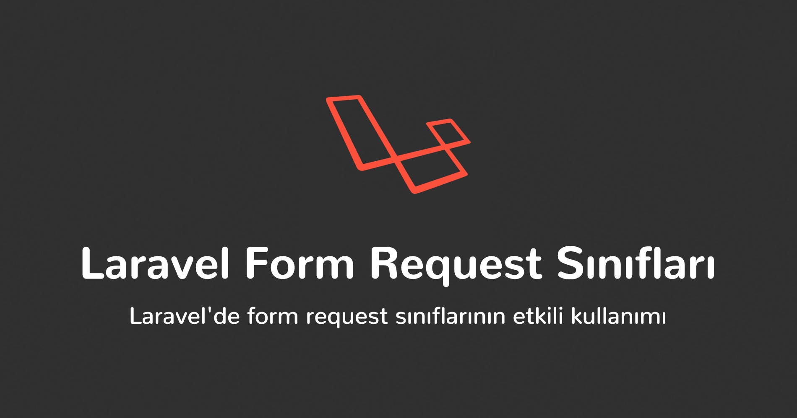

Laravel 5.0 (2015) ile beraber tanıtılan özel form request sınıfları Laravel'in nadir kullanılan ve azımsanan özelliklerinden biridir. Sadece authorization ve karmaşık validation işlemlerini kolayca yapabilmemizi sağlamak değil, aslında bunlardan daha fazlasını yaparak uygulamamıza inanılmaz faydalar ve kolaylıklar sağlayacak potansiyele sahiptirler.

## Validation

Form request'lerini birçoğumuz validation amaçlı kullanıyoruz. Nitekim Laravel dokümantasyonunun <a href="https://laravel.com/docs/master/validation#form-request-validation" target="_blank" rel="nofollow noopener noreferrer">validation bölümünde</a> yer verilmiş ve şu şekilde açıklanmış:

> Form requests are custom request classes that contain validation logic.

Yani form request'leri validation mantığını/işlemlerini içinde barındıran özel request sınıflarıdır.

Peki neden validation işlemlerini controller'da değil de ayrı bir sınıfta yapıyoruz? Bunun cevabı kişiden kişiye değişebilir. Kimileri <a href="https://en.wikipedia.org/wiki/Separation_of_concerns" target="_blank" rel="nofollow noopener noreferrer">Separation of Concerns</a> prensibine uygun kod yazmak ve böylece <a href="https://en.wikipedia.org/wiki/Single-responsibility_principle" target="_blank" rel="nofollow noopener noreferrer">Single-responsibility</a> prensibini bozmamak, kimileri de controller metodlarının şişmesini engelleyerek daha temiz bir kod yazmak amaçlı kullanmaktadırlar.

Sözü fazla uzatmadan çok basit bir örnek senaryo üzerinden validation işlemlerini etkili ve temiz bir şekilde nasıl yapılabileceğine bakalım.

**Örnek:** Blog sitesi yapıyoruz ve `Article` adında modelimiz, `ArticleController` adında da controller sınıfımız ve bu controller içinde blog yazımızı oluşturmak için `store`, güncellemek için `update` metodlarımız olsun.

```php:title=app/Http/Controllers/ArticleController.php
<?php

namespace App\Http\Controllers;

use App\Models\Article;
use Illuminate\Http\Request;

class ArticleController extends Controller
{
    // ...

    public function store(Request $request)
    {
        $data = $request->validate([
            'title'     => ['required', 'between:5,255'],
            'body'      => ['required', 'between:50,5000'],
            'is_draft'  => ['boolean'],
        ]);

        $data['is_draft'] ??= false;

        Article::create($data);

        // ...
    }

    public function update(Request $request, Article $article)
    {
        $data = $request->validate([
            'title'     => ['required', 'between:5,255'],
            'body'      => ['required', 'between:50,5000'],
            'is_draft'  => ['boolean'],
        ]);

        $data['is_draft'] ??= false;

        $article->update($data);

        // ...
    }

    // ...
}
```

Bu iki metod için route tanımlamalarımız şu şekilde olsun:

```php:title=app\routes\web.php
<?php

use App\Http\Controllers\ArticleController;
use Illuminate\Support\Facades\Route;

// ...

Route::post('articles', [ArticleController::class, 'store'])->name('articles.store');
Route::put('articles/{article}', [ArticleController::class, 'update'])->name('articles.update');

//...
```
<Info>

Route yapısını ve controller'daki metod isimlendirmelerini bu şekilde yapmamın temel nedeni <a href="https://laravel.com/docs/master/controllers#resource-controllers">Resource Controller</a> standartlarına uymaktır. Mümkün olduğunca bu yapıya uygun isimlendirmeler tercih ediyorum.

</Info>

Ve son olarak `Article` modelimizin içeriği en basit haliyle şu şekilde olsun:

```php:title=app/Models/Article.php
<?php

namespace App\Models;

use Illuminate\Database\Eloquent\Factories\HasFactory;
use Illuminate\Database\Eloquent\Model;

class Article extends Model
{
    use HasFactory;

    protected $fillable = [
        'title', 'body', 'is_draft',
    ];

    protected $casts = [
        'is_draft' => 'boolean',
    ];

    // ...
}
```

Gördüğünüz üzere `articles` tablosunda bizi ilgilendiren sadece 3 alan var: `title`, `body`, `is_draft` (`created_at` ve `updated_at` alanlarıyla şimdilik bir işimiz yok).

Asıl konuya gelecek olursak controller'daki `store` ve `update` metodlarına dikkat ederseniz validation işlemini yapmak için her iki metodda da aynı kodları yazdım. Burada yanlış bir şey yok ve her şey olduğu gibi çalışacaktır. Ancak kod tekrarı yaparak <a href="https://en.wikipedia.org/wiki/Don%27t_repeat_yourself">DRY (Don't Repeat Yourself)</a> prensibini bozmuş ve böylece WET (Write Every Time, Write Everything Twice, We Enjoy Typing, Waste Everyone's Time) çözüm üretmiş oluyoruz. Daha sonra modele yeni bir alan eklediğimizde veya bir alanı güncellediğimizde her iki yere de yazmak zorunda kalacağız. Gelin şimdi WET kodumuzu DRY yapmaya çalışalım.

### 1. İlk Girişim

Kodun tekrarlanan (validation) kısmını controller içinde yeni bir metoda yazabiliriz:

```php:title=app/Http/Controllers/ArticleController.php
<?php

namespace App\Http\Controllers;

use App\Models\Article;
use Illuminate\Http\Request;

class ArticleController extends Controller
{
    // ...

    public function store(Request $request)
    {
        Article::create($this->validateArticle($request));

        // ...
    }

    public function update(Request $request, Article $article)
    {
        $article->update($this->validateArticle($request));

        // ...
    }

    // highlight-start
    protected function validateArticle(Request $request)
    {
        $article = $request->validate([
            'title'     => ['required', 'between:5,255'],
            'body'      => ['required', 'between:50,5000'],
            'is_draft'  => ['boolean'],
        ]);

        $article['is_draft'] ??= false;

        return $article;
    }
    // highlight-end

    // ...
}
```

Böylece kod tekrarından kaçınmış ve en azından DRY prensibini sağlamış olduk. Yine burada da yanlış bir şey yok, kod çalışması gerektiği gibi çalışır.

Peki bunu daha da ileriye götürebilir miyiz? Bu çok basit bir örnek, karmaşık bir validation yapısını hayal edin. Ve nasıl daha da temiz/esnek/sürdürülebilir hale getirebiliriz? "Form request'lerini kullanarak.." dediğinizi duyar gibiyim. Evet, o halde devam edelim şuradan. 👇

### 2. Ve Form Request Nimetleri 🎉

Form request sınıfları validation işlemlerini yapmak için biçilmiş kaftandır. Hatta uygulamamızın validation katmanı olarak da düşünebiliriz.

Öncelikle `store` metodu için `StoreArticleRequest` adında bir request sınıfı oluşturalım:

```bash
php artisan make:request StoreArticleRequest
```

`app/Http/Requests` klasörüne baktığımızda `StoreArticleRequest.php` dosyasının varsayılan içeriğinin aşağıdaki gibi sadece 2 metoddan oluştuğunu görebiliriz:

```php:title=app/Http/Requests/StoreArticleRequest.php
<?php

namespace App\Http\Requests;

use Illuminate\Foundation\Http\FormRequest;

class StoreArticleRequest extends FormRequest
{
    /**
     * Determine if the user is authorized to make this request.
     *
     * @return bool
     */
    public function authorize()
    {
        return false;
    }

    /**
     * Get the validation rules that apply to the request.
     *
     * @return array
     */
    public function rules()
    {
        return [
            //
        ];
    }
}
```

#### <U>`authorize` Metodu</U>

Oluşturduğumuz form request sınıfındaki `authorize` metodu kullanıcının o isteği yapıp yapamayacağına karar verdiğimiz yer, yani yetki kontrolünü yaptığımız metod olarak düşünebiliriz. Bildiğiniz gibi, Laravel'de authorization işlemlerini farklı yerlerde çeşitli yöntemlerle harici bir paket kullanarak veya kullanmayarak yapabiliyoruz. Bunlardan biri de form request'lerindeki `authorize` metodu. Eğer başka yerde yetki kontrolü yapıyorsak burada `true` döndürebiliriz, bunda hiçbir sakınca yok.

#### <U>`rules` Metodu</U>

`rules` metodu formdan gelecek veriler için validation kurallarını tanımladığımız yer. Kısacası, `store` metodundaki validation kurallarını buraya taşıdığımızda `StoreArticleRequest` sınıfının içeriği şu şekilde olacak:

```php:title=app/Http/Requests/StoreArticleRequest.php
<?php

namespace App\Http\Requests;

use Illuminate\Foundation\Http\FormRequest;

class StoreArticleRequest extends FormRequest
{
    /**
     * Determine if the user is authorized to make this request.
     *
     * @return bool
     */
    public function authorize()
    {
        return true;
    }

    /**
     * Get the validation rules that apply to the request.
     *
     * @return array
     */
    public function rules()
    {
        return [
            'title'     => ['required', 'between:5,255'],
            'body'      => ['required', 'between:50,5000'],
            'is_draft'  => ['boolean'],
        ];
    }
}
```

Burada `is_draft` alanı view tarafında checkbox (tipi ise `boolean`) olduğu için eğer checkbox seçilmemişse `is_draft` alanının değeri gelmeyecektir. Bu yüzden varsayılan bir değer atamak zorundayız. Bunu veritabanı tarafında da yapabileceğimiz gibi form request sınıfı içinde `prepareForValidation` metodunu tanımlayarak da kolayca yapabiliyoruz.

#### <U>`prepareForValidation` Metodu</U>

`prepareForValidation` metodu adından da anlaşılacağı üzere validation işleminden önce verilerimizi manipüle etmemizi sağlamaktadır. Verilerimizi validation için hazıladığımız yer olarak düşünebiliriz. Örneğin, bir alana varsayılan veya koşullu değer atama, değerini değiştirme, (<a href="https://www.php.net/manual/en/function.trim.php" target="_blank" rel="nofollow noopener noreferrer">`trim`</a> veya <a href="https://www.php.net/manual/en/function.addslashes.php" target="_blank" rel="nofollow noopener noreferrer">`addslashes`</a> gibi) sanitize işlemlerini yapma, vb.

`is_draft` alanı için `prepareForValidation` metodunu override ederek varsayılan değer atayabileceğimizi belirtmiştim. Kullanıcının `is_draft` alanını işaretlemediği durumlarda varsayılan olarak `false` değerini atamamız gerekiyor:

```php:title=app/Http/Requests/StoreArticleRequest.php
<?php

namespace App\Http\Requests;

use Illuminate\Foundation\Http\FormRequest;

class StoreArticleRequest extends FormRequest
{
    /**
     * Determine if the user is authorized to make this request.
     *
     * @return bool
     */
    public function authorize()
    {
        return true;
    }

    /**
     * Get the validation rules that apply to the request.
     *
     * @return array
     */
    public function rules()
    {
        return [
            'title'     => ['required', 'between:5,255'],
            'body'      => ['required', 'between:50,5000'],
            'is_draft'  => ['boolean'],
        ];
    }

    // highlight-start
    protected function prepareForValidation()
    {
        $this->merge([
            'is_draft' => $this->input('is_draft', false),
        ]);
    }
    // highlight-end
}
```

Böylece eğer `is_draft` checkbox alanı seçilmemişse `false` değerini, seçilmişse de `boolean` olduğu için 1, '1' veya `true` değerini atayarak validation işlemine hazırlamış olduk.

Verilerimizi ve kurallarımızı validation için hazırladıktan sonra bir de validation sonrasını düşünmemiz gerekiyor. Örneğin, hata mesajları. Bildiğiniz gibi validation işlemi başarısız olduğunda request controller metoduna girmeden (hata mesajlarıyla birlikte) geldiği yere geri gönderilir. 😅 AJAX isteği gelidyse de 422 status koduyla hata mesajlarının JSON çıktısı döndürülür.

Peki bu hata mesajlarını nasıl özelleştirebiliriz? Varsayılan mesajlar nelerdir ve nerede tutulurlar?

#### <U>`messages` Metodu</U>

Validation hataları için varsayılan olarak `resources/lang/x/validation.php` içindeki belirlenen mesajlar kullanılır. Bu dosyadan hem global hem de belirli alanların hata mesajlarını özelleştirebileceğimiz gibi aynı zamanda form request sınıfı içindeki `messages` metodunu override ederek de yapabiliyoruz:

```php:title=app/Http/Requests/StoreArticleRequest.php
<?php

namespace App\Http\Requests;

use Illuminate\Foundation\Http\FormRequest;

class StoreArticleRequest extends FormRequest
{
    /**
     * Determine if the user is authorized to make this request.
     *
     * @return bool
     */
    public function authorize()
    {
        return true;
    }

    /**
     * Get the validation rules that apply to the request.
     *
     * @return array
     */
    public function rules()
    {
        return [
            'title'     => ['required', 'between:5,255'],
            'body'      => ['required', 'between:50,5000'],
            'is_draft'  => ['boolean'],
        ];
    }

    protected function prepareForValidation()
    {
        $this->merge([
            'is_draft' => $this->input('is_draft', false),
        ]);
    }

    // highlight-start
    public function messages()
    {
        return [
            'title.required'   => ':attribute boş bırakılmamalıdır.',
            'title.between'    => ':attribute :min ile :max karakter arası olmalıdır.',
            'body.required'    => ':attribute boş bırakılmamalıdır.',
            'body.between'     => ':attribute :min ile :max karakter arası olmalıdır.',
            'is_draft.boolean' => ':attribute değeri geçerli değil.',
        ];
    }
    // highlight-end
}
```

Burada dikkatli olmamız gereken bir nokta var. Hata mesajlarındaki `:attribute` kısmı alanların ismine (formdaki input/select/textarea alanının `name` değerine) karşılık gelir. Dolayısıyla yukarıdaki mesajların ilk 2 satırına `title`, sonraki 2 satırına `body` ve son satıra `is draft` basılır. Örneğin, `title` alanını boş bıraktığımızda _"title boş bırakılmamalıdır."_ hata mesajını alırız. Bu da bizim için kullanışlı olmayacaktır.

Bunu `resources/lang/x/validation.php` içindeki `attributes` kısmında özel isimler tanımlayarak çözebileceğimiz gibi aynı zamanda form request'in bir diğer nimeti olan `attributes` metodunu override ederek de çözüm üretebiliriz.

#### <U>`attributes` Metodu</U>

`attributes` metodu hata mesajlarındaki `:attribute` kısmını, yani formdaki elemanların adını özelleştirebilmemize olanak sağlar:

```php:title=app/Http/Requests/StoreArticleRequest.php
<?php

namespace App\Http\Requests;

use Illuminate\Foundation\Http\FormRequest;

class StoreArticleRequest extends FormRequest
{
    /**
     * Determine if the user is authorized to make this request.
     *
     * @return bool
     */
    public function authorize()
    {
        return true;
    }

    /**
     * Get the validation rules that apply to the request.
     *
     * @return array
     */
    public function rules()
    {
        return [
            'title'     => ['required', 'between:5,255'],
            'body'      => ['required', 'between:50,5000'],
            'is_draft'  => ['boolean'],
        ];
    }

    protected function prepareForValidation()
    {
        $this->merge([
            'is_draft' => $this->input('is_draft', false),
        ]);
    }

    public function messages()
    {
        return [
            'title.required'   => ':attribute boş bırakılmamalıdır.',
            'title.between'    => ':attribute :min ile :max karakter arası olmalıdır.',
            'body.required'    => ':attribute boş bırakılmamalıdır.',
            'body.between'     => ':attribute :min ile :max karakter arası olmalıdır.',
            'is_draft.boolean' => ':attribute değeri geçerli değil.',
        ];
    }

    // highlight-start
    public function attributes()
    {
        return [
            'title'    => 'Başlık',
            'body'     => 'İçerik',
            'is_draft' => 'Taslak',
        ];
    }
    // highlight-end
}
```

#### <U>`withValidator` Metodu</U>

Validation işleminin hemen sonrasında özel olarak bazı değerleri kontrol etmemiz veya özel validation işemini gerçekleştirmemiz gerekebilir. Veya tamamen başka fonksiyon(lar) çalıştırma ihtiyacımız da olabilir. İşte tam bu noktada `withValidator` metodu, namıdiğer "after" hook, devreye giriyor.

Örnek senaryomuzda ihtiyacımız olmadığı için kullanmayacağız ama başlıkta "tiktok" veya "tik tok" kelimesininin kullanılmasını engellemek istediğimizi düşünürsek `withValidator` metodundan şu şekilde yararlanabiliriz:

```php
public function withValidator($validator)
{
    $validator->after(function ($validator) {
        if (mb_stripos($this->title, 'tiktok') !== false || mb_stripos($this->title, 'tik tok') !== false) {
            $validator->errors()->add('title', 'Başlıkta "tiktok" veya "tik tok" kelimesi kullanılmamlı.');
        }
    });
}
```

Eğer buradaki validation işlemi daha karmaşık veya (başka yerlerde de kullanabileceğiniz) kalıcı bir kural olacaksa özel validation kuralı oluşturmanız daha doğru olur.

Eğer ("after" hook dâhil) validation işlemi başarısız olursa request daha controller içine girmeden hata mesajlarıyla beraber geri gönderilir demiştik. Genelde yeni kayıt sayfasından form gönderildiği için oraya geri gönderilerek hata mesajları ilgili yerlere basılır. Peki geri gönderilmesini değil, başka bir yere gönderilmesini istiyorsak ne yapacağız? Özel URL tanımlayamıyor muyuz?

#### <U>`getRedirectUrl` Metodu</U>

Validation başarısız sonuçlandığında geriye değil özel URL adresine redirect yapmak istiyorsak `getRedirectUrl` metodunu override edebiliriz:

```php
public function getRedirectUrl()
{
    return route('articles.index');

    // veya

    return '/articles';
}
```

Bu metoda da ihtiyacımız olmadığından örneğimize dâhil etmedim.

Peki yönlendirmeden önce özel işlemler yapmak istiyorsak ne olacak? Örneğin, hataları loglara kaydetmek ve daha sonra yönlendirme yapmak istiyoruz. Bunun için de bir metod var mı?

#### <U>`failedValidation` Metodu</U>

Validation işlemi başarısız olduğunda normalde `Illuminate\Validation\ValidationException` hatası fırlatılarak hata mesajlarıyla beraber geri redirect uygulanır. Bu standart ve doğru bir yöntem olmasına rağmen bazen başka işlemler yapmak isteyebiliriz. Yani redirect olmadan önce birkaç işleme ihtiyacımız olabilir. Veya özel tanımladığımız hataları fırlatmak isteyebiliriz. Bunun için `failedValidation` metodunu override edebiliriz:

```php:title=app/Http/Requests/StoreArticleRequest.php
<?php

namespace App\Http\Requests;

use Illuminate\Contracts\Validation\Validator;
use Illuminate\Foundation\Http\FormRequest;
use Illuminate\Support\Facades\Log;

class StoreArticleRequest extends FormRequest
{
    /**
     * Determine if the user is authorized to make this request.
     *
     * @return bool
     */
    public function authorize()
    {
        return true;
    }

    /**
     * Get the validation rules that apply to the request.
     *
     * @return array
     */
    public function rules()
    {
        return [
            'title'     => ['required', 'between:5,255'],
            'body'      => ['required', 'between:50,5000'],
            'is_draft'  => ['boolean'],
        ];
    }

    protected function prepareForValidation()
    {
        $this->merge([
            'is_draft' => $this->input('is_draft', false),
        ]);
    }

    public function messages()
    {
        return [
            'title.required'   => ':attribute boş bırakılmamalıdır.',
            'title.between'    => ':attribute :min ile :max karakter arası olmalıdır.',
            'body.required'    => ':attribute boş bırakılmamalıdır.',
            'body.between'     => ':attribute :min ile :max karakter arası olmalıdır.',
            'is_draft.boolean' => ':attribute değeri geçerli değil.',
        ];
    }

    public function attributes()
    {
        return [
            'title'    => 'Başlık',
            'body'     => 'İçerik',
            'is_draft' => 'Taslak',
        ];
    }

    // highlight-start
    protected function failedValidation(Validator $validator)
    {
        // Validation hatalarını loglara yaz.
        Log::debug(json_encode($validator->errors(), JSON_PRETTY_PRINT | JSON_UNESCAPED_UNICODE));

        // Sonra normal akışa devam et.
        parent::failedValidation($validator);
    }
    // highlight-end
}
```

Bunun tam tersini de yapabiliriz. Yani validation başarılı olduğunda istediğimiz işlemleri `passedValidation` metodu yardımıyla yapabiliriz.

#### <U>`passedValidation` Metodu</U>

Validation işlemi başarılı olduğunda tetiklenecek olan metoddur.

```php:title=app/Http/Requests/StoreArticleRequest.php
<?php

namespace App\Http\Requests;

use Illuminate\Contracts\Validation\Validator;
use Illuminate\Foundation\Http\FormRequest;
use Illuminate\Support\Facades\Log;

class StoreArticleRequest extends FormRequest
{
    /**
     * Determine if the user is authorized to make this request.
     *
     * @return bool
     */
    public function authorize()
    {
        return true;
    }

    /**
     * Get the validation rules that apply to the request.
     *
     * @return array
     */
    public function rules()
    {
        return [
            'title'     => ['required', 'between:5,255'],
            'body'      => ['required', 'between:50,5000'],
            'is_draft'  => ['boolean'],
        ];
    }

    protected function prepareForValidation()
    {
        $this->merge([
            'is_draft' => $this->input('is_draft', false),
        ]);
    }

    public function messages()
    {
        return [
            'title.required'   => ':attribute boş bırakılmamalıdır.',
            'title.between'    => ':attribute :min ile :max karakter arası olmalıdır.',
            'body.required'    => ':attribute boş bırakılmamalıdır.',
            'body.between'     => ':attribute :min ile :max karakter arası olmalıdır.',
            'is_draft.boolean' => ':attribute değeri geçerli değil.',
        ];
    }

    public function attributes()
    {
        return [
            'title'    => 'Başlık',
            'body'     => 'İçerik',
            'is_draft' => 'Taslak',
        ];
    }

    protected function failedValidation(Validator $validator)
    {
        // Validation hatalarını loglara yaz.
        Log::debug(json_encode($validator->errors(), JSON_PRETTY_PRINT | JSON_UNESCAPED_UNICODE));

        // Sonra normal akışa devam et.
        parent::failedValidation($validator);
    }

    // highlight-start
    protected function passedValidation()
    {
        //
    }
    // highlight-end
}
```

Peki validation değil de _authorization_ işlemi başarısız olduğunda bazı işlemler yapmak istiyorsak? Daha önce form request sınıflarında `authorize` metodunu kullanarak authorization işlemini yapabileceğimizden bahsetmiştik. Eğer authorization başarısız olursa istediğimiz işlemleri nasıl yaparız?

#### <U>`failedAuthorization` Metodu</U>

Authorization işlemi başarısız olduğunda normalde 403 status koduyla `Illuminate\Auth\Access\AuthorizationException` hatası fırlatılır. Bu varsayılan davranışı `failedAuthorization` metodunu override ederek değiştirebiliriz. Üstteki örnek gibi, authorization işleminin başarısız olduğuna ve hangi request içinde gerçekleştiğine dair log kayıtlarını tutmak istiyorsak şu şekilde yapabiliriz:

```php:title=app/Http/Requests/StoreArticleRequest.php
<?php

namespace App\Http\Requests;

use Illuminate\Contracts\Validation\Validator;
use Illuminate\Foundation\Http\FormRequest;
use Illuminate\Support\Facades\Log;

class StoreArticleRequest extends FormRequest
{
    /**
     * Determine if the user is authorized to make this request.
     *
     * @return bool
     */
    public function authorize()
    {
        return true;
    }

    /**
     * Get the validation rules that apply to the request.
     *
     * @return array
     */
    public function rules()
    {
        return [
            'title'     => ['required', 'between:5,255'],
            'body'      => ['required', 'between:50,5000'],
            'is_draft'  => ['boolean'],
        ];
    }

    protected function prepareForValidation()
    {
        $this->merge([
            'is_draft' => $this->input('is_draft', false),
        ]);
    }

    public function messages()
    {
        return [
            'title.required'   => ':attribute boş bırakılmamalıdır.',
            'title.between'    => ':attribute :min ile :max karakter arası olmalıdır.',
            'body.required'    => ':attribute boş bırakılmamalıdır.',
            'body.between'     => ':attribute :min ile :max karakter arası olmalıdır.',
            'is_draft.boolean' => ':attribute değeri geçerli değil.',
        ];
    }

    public function attributes()
    {
        return [
            'title'    => 'Başlık',
            'body'     => 'İçerik',
            'is_draft' => 'Taslak',
        ];
    }

    protected function failedValidation(Validator $validator)
    {
        // Validation hatalarını loglara yaz.
        Log::debug(json_encode($validator->errors(), JSON_PRETTY_PRINT | JSON_UNESCAPED_UNICODE));

        // Sonra normal akışa devam et.
        parent::failedValidation($validator);
    }

    protected function passedValidation()
    {
        //
    }

    // highlight-start
    protected function failedAuthorization()
    {
        // Authorization işleminin başarısız olduğunu ve nerede gerçekleştiğini loglara yaz.
        Log::debug(__CLASS__.': Authorization başarısız.');

        // Sonra normal akışa devam et.
        parent::failedAuthorization();
    }
    // highlight-end
}
```

#### <U>`passesAuthorization` Metodu</U>

Validation kısmı için son olarak `passesAuthorization` metodundan bahsetmek istiyorum. Daha önce hiç kullanmadım, nerede ve ne zaman ihtiyacımız olur bir fikrim yok ama sakın ola `authorize` metodu içinde kullanmayın. 😅

`passesAuthorization` metodu request'in authorization işleminden başarılı şekilde geçip geçmediğini tespit etmemizi sağlıyor. Bunun için form request sınıfındaki `authorize` metodunu çalıştırarak sonucunu döndürür.

```php
if ($this->passesAuthorization()) {
    // `authorize` metodu `true` döndürdü.
}
```

#### <U>Controller İçinde Kullanımı</U>

Özel request sınıfını yazdıktan sonra controller'ın `store` metodu içinde varsayılan `Illuminate\Http\Request` sınıfı yerine `App\Http\Requests\StoreArticleRequest` sınıfını kullanalım:

```php:title=app/Http/Controllers/ArticleController.php
<?php

namespace App\Http\Controllers;

use App\Http\Requests\StoreArticleRequest;
use App\Models\Article;
use Illuminate\Http\Request;

class ArticleController extends Controller
{
    // ...

    public function store(StoreArticleRequest $request)
    {
        Article::create($request->validated());

        // ...
    }

    // ...
}
```

Formdan gelecek olan veriler `StoreArticleRequest` içinde tanımlanan validation kurallarını başarılı şekilde geçtiği taktirde `store` metodu tetiklenecek ve `validated` metodunu kullanarak validation süzgecinden geçen verilerimizi alabileceğiz.

Gördüğünüz gibi `store` metodunu bir hayli temizledik ve controller sınıfını validation işlemlerinden kurtardık. Peki blog yazımızı güncellediğimiz `update` metodunda da bu request sınıfını kullanabilir miyiz? Eğer aynı validation kurallarına ve aynı işlemlere ihtiyacımız varsa rahatlıkla kullanabiliriz. Hatta ufak farklılıklar varsa ve zamanla karmaşık/farklı bir yapıya dönüşmeyeceğinden emin isek 2 request'i birleştirebiliriz. Örneğin, validation kurallarının farklılık gösterdiğini ve bunları birleştirme istediğimi düşünürsek şuna benzer bir yapı oluşturabiliriz:

```php
protected function storeRules()
{
    return [
        'title'     => ['required', 'between:5,255'],
        'slug'      => ['required', 'between:5,255', 'unique:articles,slug'],
        'body'      => ['required', 'between:5,5000'],
        'is_draft'  => ['boolean'],
    ];
}

protected function updateRules()
{
    return [
        'title'     => ['required', 'between:5,255'],
        'body'      => ['required', 'between:5,5000'],
        'is_draft'  => ['boolean'],
    ];
}

public function rules()
{
    return $this->isMethod('POST') ? $this->storeRules() : $this->updateRules();
}
```

<Info>

Bu şekilde request sınıflarını birleştirerek birkaç yerde kullanmak istediğimizde karışıklık yaratmaması için request sınıfını
`StoreArticleRequest` değil, `ArticleRequest` olarak isimlendirmenizde yarar var. Çünkü isimdeki ön ek (`Store`) request'in kullanılacağı controller metodunun ismine denk gelmektedir.

</Info>

Sonuç olarak bir validation süreci için ihtiyacımız olabilecek tüm işlemleri gördük. Peki form request sınıflarıyla daha fazla neler yapabılabilir?

## Validation Ötesi

Bazen mevcut request'e özel işlemler yapmaya ihtiyaç duyabiliriz. Veya mevcut request içinde gelen form verilerini kullanarak özel kontrol yapıları oluşturmak isteriz. Örneğin, kişisel projelerimin birinde şöyle bir form request sınıfı var:

```php:title=app/Http/Controllers/UpgradeSubscriptionRequest.php
<?php

namespace App\Http\Requests;

use App\Enums\Plan;
use BenSampo\Enum\Rules\EnumValue;
use Illuminate\Foundation\Http\FormRequest;
use Illuminate\Support\Facades\DB;

class UpgradeSubscriptionRequest extends FormRequest
{
    /**
     * Determine if the user is authorized to make this request.
     *
     * @return bool
     */
    public function authorize()
    {
        return true;
    }

    /**
     * Get the validation rules that apply to the request.
     *
     * @return array
     */
    public function rules()
    {
        return [
            'plan' => ['required', 'integer', 'min:2', new EnumValue(Plan::class, false)],
        ];
    }

    /**
     * Kullanıcının yükseltmek istediği paket mevcut paketinden yüksek olup olmadığını kontrol et.
     *
     * @return bool
     */
    public function userCanUpgradePlan()
    {
        return $this->user()->plan < $this->plan;
    }

    /**
     * Kullanıcının zaten bir başvurusunun olup olmadığını kontrol et.
     *
     * @return bool
     */
    public function userAlreadyApplied()
    {
        return DB::table('upgrade_applications')->where('user_id', $this->user()->id)->exists();
    }
}
```

Bu request sınıfı kullanıcının üyelik yükseltme başvurusu yaptığı sırada kullanılmaktadır. Validation işlemine ek olarak 2 tane kontrol yapısını oluşturan metod yazdım. Kullanıcının yükseltmek istediği paket mevcut paketinden yüksek olmak zorunda. Bunu `userCanUpgradePlan` metodu ile kontrol ediyorum. Ve kullanıcının (devam eden) mevcut başvurusu varsa tekrar başvuru yapmasına gerek yok. Bunu da `userAlreadyApplied` metodu ile tespit ediyorum.

Eğer burada kullanıcının yükseltmek istediği paket mevcut paketinden yüksek ise ve devam eden başvurusu yok ise o kullanıcı için yeni bir başvuru oluşturulur ve paket, ödeme yöntemi vs. ile ilgili bilgiler kullanıcıya e-posta ile gönderilir.

Tabi ki bunlar UI tarafında da kontrol edilmekte ve üyelik yükseltme sayfasında kullanıcının sadece mevcut paketinden yüksek olan paketler listelenmektedir. Ama kullanıcının form verilerini manipüle edebileceğini aklımızdan çıkarmamalıyız.

Peki bu metodları controller içinde yazamaz mıydım? Yazabilirdim elbette ama request verileriyle ilgili kontrol yapılarını form request sınıfı içinde yapmayı mantıklı buluyorum. Çünkü hem mevcut request'e özel verileri hem de o request'i yapan kullanıcı bilgisini kullanarak karar mekanizması oluşturdum ve böylece **mevcut request içindeki bir şeyleri çözmüş oldum**. Bu açıdan baktığımızda controller'dan ziyade form request sınıfının bu tarz işlemler için daha uygun olduğunu görebiliriz.
