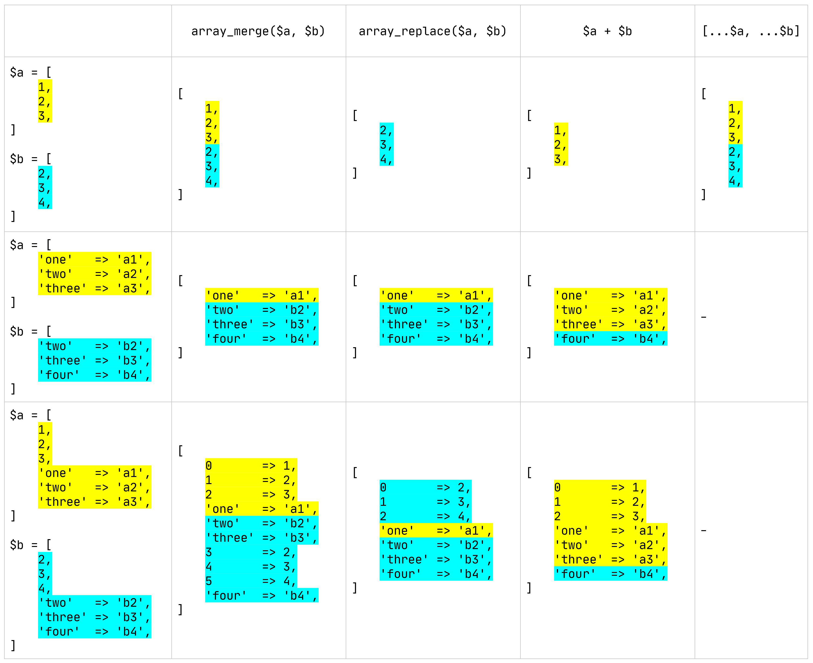

PHP'de dizi birleştirmek istediğimizde birçoğumuzun aklına ilk olarak <a href="https://www.php.net/manual/en/function.array-merge.php" target="_blank" rel="nofollow noopener noreferrer">`array_merge`</a> fonksiyonu gelir. Çünkü esnek olarak tasarlanan bu fonksiyon çoğu durumda işimizi görür. Ama PHP'de dizi birleştirme işlemi sadece bu fonksiyon ile sınırlı değildir. PHP 5.3 ile gelen <a href="https://www.php.net/manual/en/function.array-replace.php" target="_blank" rel="nofollow noopener noreferrer">`array_replace`</a> fonksiyonu, <a href="https://www.php.net/manual/en/language.operators.array.php" target="_blank" rel="nofollow noopener noreferrer">`+`</a> (union) operatörü ve son olarak PHP 7.4 ile gelen <a href="https://wiki.php.net/rfc/spread_operator_for_array" target="_blank" rel="nofollow noopener noreferrer">spread operatörü</a> de dizi birleştirirken kullanılan yöntemler arasındadır. Ancak aralarındaki farkların dokümantasyonda tam olarak açıklanmadığını görebiliriz.

Bu yöntemleri teker teker ele almadan önce <a href="https://p.softonsofa.com/php-array_merge-vs-array_replace-vs-plus-aka-union/" target="_blank" rel="nofollow noopener noreferrer">Jarek Tkaczyk</a>'tan esinlerek hazırladığım karşılaştırma görselini inceleyelim:



-   [`array_merge` Fonksiyonu](#array_merge-fonksiyonu)
-   [`array_replace` Fonksiyonu](#array_replace-fonksiyonu)
-   [`+` (Union) Operatörü](#-union-operatörü)
-   [Spread Operatörü](#spread-operatörü)

## `array_merge` Fonksiyonu

Bir veya daha fazla dizinin öğelerini <U>sırayla</U> birleştirir/günceller ve yeni bir dizi döndürür.

Eğer dizilerin aynı olan string tipindeki anahtarları varsa, en sondaki öncekiyi/öncekileri ezer. Ancak, numerik anahtarları olan dizilerde herhangi bir ezme gerçekleşmez, birbirinin sonuna eklenerek birleştirme işlemi yapılır ve yeni oluşan dizi anahtarları sıfırdan başlayarak tekrardan sıralanır.

Eskiden <a href="https://www.php.net/manual/en/function.array-merge.php" target="_blank" rel="nofollow noopener noreferrer">`array_merge`</a> fonksiyonunu kullanırken en az bir parametre göndermek zorunluydu ama PHP 7.4'ten itibaren parametresiz olarak da kullanılabilmekte.

## `array_replace` Fonksiyonu

Parametre olarak gönderilen ilk diziyi sonraki belirtilen dizilerin değerleriyle birleştirir/günceller ve yeni bir dizi döndürür.

Eğer ilk dizideki bir anahtar (string veya numerik farketmeksizin) sonraki dizilerde mevcutsa, en sonda bulunan dizideki değer ilk dizideki değeri ezer. İlk dizide olmayıp sonraki dizilerde bulunan anahtarlar ilk diziye eklenirler. Sadece ilk dizide bulunan anahtarların değerlerine dokunulmaz.

String tipinde anahtarları olan diziler için <a href="https://www.php.net/manual/en/function.array-merge.php" target="_blank" rel="nofollow noopener noreferrer">`array_merge`</a> fonksiyonunu ile aynı işlevi gördüğü söylenebilir. Ama numerik anahtarlara sahip dizilerde <a href="https://www.php.net/manual/en/function.array-replace.php" target="_blank" rel="nofollow noopener noreferrer">`array_replace`</a> fonksiyonu sondaki dizilerin değerleri baştaki dizilerin değerlerini ezerken <a href="https://www.php.net/manual/en/function.array-merge.php" target="_blank" rel="nofollow noopener noreferrer">`array_merge`</a> fonksiyonunda herhangi bir ezme gerçekleşmez, sadece sonuna eklenir ve tekrar sıralama yapılır.

```php
$a = [1, 2, 3, 'a'];
$b = [4, 5, 6, 'b'];
$c = [7, 8, 9, 'c'];

array_merge($a, $b, $c); // [1, 2, 3, 'a', 4, 5, 6, 'b', 7, 8, 9, 'c']
array_replace($a, $b, $c); // [7, 8, 9, 'c']
```

## `+` (Union) Operatörü

Sol taraftaki diziye sağ taraftaki diziyi ekleyerek yeni dizi döndürür.

String veya numerik farketmeksizin sol taraftaki dizinin anahtarları daima önceliğe sahiptir. Yani sol taraftaki dizinin anahtarları sağ taraftaki dizinin anahtarlarını ezer. Soldaki dizide bulunmayıp sağdaki dizide bulunan değerler ise soldaki dizinin sonuna eklenir. <a href="https://www.php.net/manual/en/function.array-replace.php" target="_blank" rel="nofollow noopener noreferrer">`array_replace`</a> fonksiyonunun tam tersi olduğu söylenebilir.

```php
$a = [1, 2, 3, 'a'];
$b = [4, 5, 6, 'b'];
$c = [7, 8, 9, 'c'];

array_replace($a, $b, $c); // [7, 8, 9, 'c']
$a + $b + $c; // [1, 2, 3, 'a']
```

<Info>

`+` (union) operatörünü kullanırken dizilerin sıraları çok önemlidir. Örneğin, `$a + $b` ile `$b + $a` tamamen farklı sonuçlar döndürebilir.

</Info>

## Spread Operatörü

Bir veya daha fazla dizinin öğelerini <U>sırayla</U> birleştirir ve yeni bir dizi döndürür. **Sadece numerik anahtarlara sahip olan dizilerde kullanılabilmektedir.**

Spread operatörü dizilerdeki herhangi bir elemanı ezmez, birbirinin sonuna ekleyerek birleştirme işlemi yapar ve yeni oluşan dizi anahtarlarını sıfırdan başlayarak tekrardan sıralar. <a href="https://www.php.net/manual/en/function.array-merge.php" target="_blank" rel="nofollow noopener noreferrer">`array_merge`</a> fonksiyonunu ile aynı işlevi gördüğü söylenebilir.

```php
$a = [1, 2, 3, 'a'];
$b = [4, 5, 6, 'b'];
$c = [7, 8, 9, 'c'];

array_merge($a, $b, $c); // [1, 2, 3, 'a', 4, 5, 6, 'b', 7, 8, 9, 'c']
[...$a, ...$b, ...$c]; // [1, 2, 3, 'a', 4, 5, 6, 'b', 7, 8, 9, 'c']
```